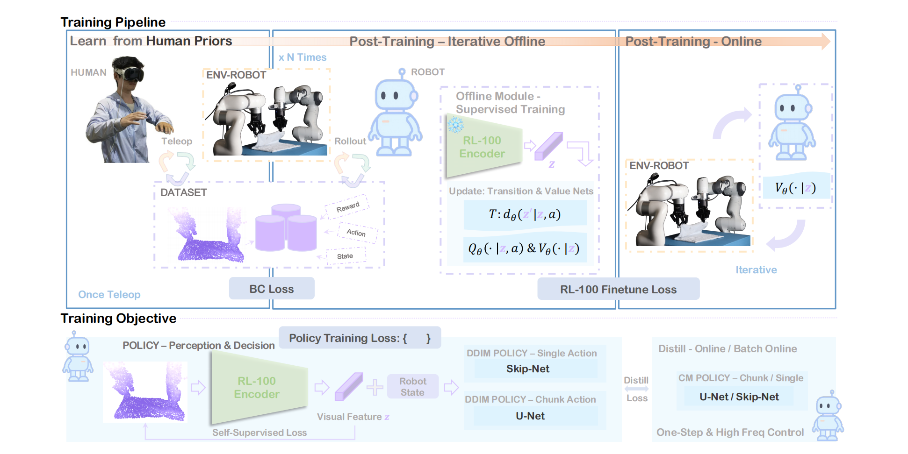

# RL-100 on 3D-Diffusion-Policy

本仓库是在 [3D Diffusion Policy (DP3)](https://3d-diffusion-policy.github.io) 基础上实现并整理的 **RL-100** 版本，包含：

- DP3 行为克隆训练与评测
- RL-100 的 `IL -> Offline RL -> Online RL` 三阶段训练
- MetaWorld / Adroit / DexArt 演示数据采集脚本
- DDIM 主策略与 Consistency Model 的评测入口

论文：

- DP3: <https://arxiv.org/abs/2403.03954>
- RL-100: <https://arxiv.org/abs/2510.14830>

<div align="center">
  
</div>

## 仓库结构

核心代码位于 [3D-Diffusion-Policy](/home/yrz/RL-100/3D-Diffusion-Policy)：

- [train_rl100.py](/home/yrz/RL-100/3D-Diffusion-Policy/train_rl100.py)：RL-100 训练入口
- [eval_rl100.py](/home/yrz/RL-100/3D-Diffusion-Policy/eval_rl100.py)：RL-100 单 checkpoint 评测入口
- [rl100.yaml](/home/yrz/RL-100/3D-Diffusion-Policy/diffusion_policy_3d/config/rl100.yaml)：RL-100 主配置
- [config/task](/home/yrz/RL-100/3D-Diffusion-Policy/diffusion_policy_3d/config/task)：各任务配置
- [scripts](/home/yrz/RL-100/scripts)：数据采集、DP3 训练与评测脚本

## 环境安装

环境配置 **直接沿用 DP3**，这里没有额外改动。

- 安装说明见 [INSTALL.md](/home/yrz/RL-100/INSTALL.md)
- 常见报错见 [ERROR_CATCH.md](/home/yrz/RL-100/ERROR_CATCH.md)

如果你已经能正常跑 DP3，就可以直接跑 RL-100。

## 数据采集

所有演示数据默认写入 [3D-Diffusion-Policy/data](/home/yrz/RL-100/3D-Diffusion-Policy/data)。

### MetaWorld

脚本： [gen_demonstration_metaworld.sh](/home/yrz/RL-100/scripts/gen_demonstration_metaworld.sh)

```bash
bash scripts/gen_demonstration_metaworld.sh dial-turn
bash scripts/gen_demonstration_metaworld.sh basketball sparse
bash scripts/gen_demonstration_metaworld.sh push dense
```

说明：

- 第一个参数是 MetaWorld 任务名
- 第二个参数是奖励类型，默认 `sparse`
- 当前脚本固定采集 `100` 个 episode

### Adroit

脚本： [gen_demonstration_adroit.sh](/home/yrz/RL-100/scripts/gen_demonstration_adroit.sh)

```bash
bash scripts/gen_demonstration_adroit.sh door
bash scripts/gen_demonstration_adroit.sh hammer
bash scripts/gen_demonstration_adroit.sh pen
```

说明：

- 当前脚本固定采集 `10` 个 episode
- 依赖 `third_party/VRL3/ckpts/` 下的 expert checkpoint

### DexArt

脚本： [gen_demonstration_dexart.sh](/home/yrz/RL-100/scripts/gen_demonstration_dexart.sh)

```bash
bash scripts/gen_demonstration_dexart.sh laptop
bash scripts/gen_demonstration_dexart.sh faucet
bash scripts/gen_demonstration_dexart.sh bucket
bash scripts/gen_demonstration_dexart.sh toilet
```

说明：

- 当前脚本固定采集 `100` 个 episode
- 依赖 `third_party/dexart-release/assets/rl_checkpoints/`

## DP3 基线训练与评测

如果你只想跑原始 DP3 行为克隆流程，可以继续用原脚本。

### 训练

脚本： [train_policy.sh](/home/yrz/RL-100/scripts/train_policy.sh)

```bash
bash scripts/train_policy.sh dp3 metaworld_dial-turn exp1 0 0
bash scripts/train_policy.sh dp3 adroit_hammer exp1 0 0
bash scripts/train_policy.sh simple_dp3 dexart_laptop exp1 0 0
```

参数顺序：

1. 算法名：`dp3` 或 `simple_dp3`
2. 任务名：例如 `metaworld_dial-turn`
3. 附加字符串：用于组成实验名
4. 随机种子
5. GPU id

### 评测

脚本： [eval_policy.sh](/home/yrz/RL-100/scripts/eval_policy.sh)

```bash
bash scripts/eval_policy.sh dp3 metaworld_dial-turn exp1 0 0
```

## RL-100 训练

RL-100 不走 shell 脚本，直接用 Hydra 入口。

先进入项目目录：

```bash
cd 3D-Diffusion-Policy
```

### 基本训练

```bash
python train_rl100.py task=metaworld_dial-turn
```

### 常见覆盖写法

```bash
python train_rl100.py \
  task=metaworld_dial-turn \
  training.seed=0 \
  training.device=cuda:0 \
  logging.use_wandb=true \
  task.env_runner.eval_episodes=100
```

### 指定从某个 checkpoint 恢复

```bash
python train_rl100.py \
  task=metaworld_dial-turn \
  training.resume=true \
  training.resume_path=/path/to/checkpoints/after_il.ckpt
```

### 训练阶段

`train_rl100.py` 默认执行以下流程：

1. `IL`：先用 demonstration 训练 DP3/RL100 policy
2. `Offline RL`：训练 transition model、IQL critics、offline PPO，并做 OPE gate
3. `Data Collection + IL Retrain`：收集新轨迹并并回数据集，再做 IL retrain
4. `Online RL`：对 fresh rollout 做 on-policy PPO + GAE
5. `Final Eval`：按配置评测 `ddim` 和/或 `cm`

相关主配置见 [rl100.yaml](/home/yrz/RL-100/3D-Diffusion-Policy/diffusion_policy_3d/config/rl100.yaml)。

## RL-100 评测

脚本入口： [eval_rl100.py](/home/yrz/RL-100/3D-Diffusion-Policy/eval_rl100.py)

### 评测主模型 DDIM

```bash
python eval_rl100.py \
  task=metaworld_dial-turn \
  checkpoint_path=/path/to/checkpoints/final.ckpt \
  runtime.eval_policy_mode=ddim \
  runtime.eval_use_ema=false \
  task.env_runner.eval_episodes=100
```

### 评测 EMA-DDIM

```bash
python eval_rl100.py \
  task=metaworld_dial-turn \
  checkpoint_path=/path/to/checkpoints/final.ckpt \
  runtime.eval_policy_mode=ddim \
  runtime.eval_use_ema=true \
  task.env_runner.eval_episodes=100
```

### 评测 Consistency Model

```bash
python eval_rl100.py \
  task=metaworld_dial-turn \
  checkpoint_path=/path/to/checkpoints/final.ckpt \
  runtime.eval_policy_mode=cm \
  runtime.eval_use_ema=true \
  task.env_runner.eval_episodes=100
```

## 输出内容

训练输出目录由 Hydra 管理，默认在：

```bash
3D-Diffusion-Policy/outputs/rl100_<task>_seed<seed>/<date>_<time>/
```

其中通常包含：

- `checkpoints/after_il.ckpt`
- `checkpoints/offline_iter_<N>.ckpt`
- `checkpoints/online_iter_<N>.ckpt`
- `checkpoints/final.ckpt`
- `plots/` 下的各类 loss / success 曲线

## 重要配置项

常用项基本都在 [rl100.yaml](/home/yrz/RL-100/3D-Diffusion-Policy/diffusion_policy_3d/config/rl100.yaml)：

- `training.num_offline_iterations`
- `training.critic_epochs`
- `training.ppo_epochs`
- `training.ppo_inner_steps`
- `training.collection_episodes`
- `training.online_rl_iterations`
- `training.online_collection_episodes`
- `training.rl_policy_lr`
- `runtime.collection_policy`
- `runtime.collection_use_ema`
- `runtime.il_retrain_success_only`
- `runtime.final_eval_policies`
- `runtime.final_eval_use_ema`
- `task.env_runner.eval_episodes`

任务数据路径、观测维度、评测 episode 数在各自 task yaml 里定义，例如：

- [metaworld_dial-turn.yaml](/home/yrz/RL-100/3D-Diffusion-Policy/diffusion_policy_3d/config/task/metaworld_dial-turn.yaml)

## 注意事项

### 1. `eval_episodes` 以 task yaml 为准

最终训练评测和 `eval_rl100.py` 都直接读取 `task.env_runner.eval_episodes`。  
如果要改评测轮数，改 task yaml 或在命令行覆盖：

```bash
python train_rl100.py task=metaworld_dial-turn task.env_runner.eval_episodes=100
```

### 2. `il_retrain_success_only` 只影响 IL retrain，不影响 RL 本身

当前逻辑是：

- offline RL / online RL 都使用完整采样轨迹，包括失败轨迹
- `success-only` 只作用于后续 `IL retrain` 的数据筛选

这和 RL 训练、IL 重训的语义已经拆开了。

### 3. `prediction_type` 必须是 `epsilon`

RL-100 的 PPO ratio 计算依赖 `epsilon` 参数化。当前配置已固定为：

```yaml
policy:
  noise_scheduler:
    prediction_type: epsilon
```

不要改成 `sample`。

### 4. `sigma_max` 的值

根据 RL-100 论文 `2510.14830 v4` 的消融结论，stochastic DDIM 的标准差上界需要按控制模式区分：

- `sigma_max = 0.8`
  - Adroit
  - Mujoco locomotion
  - 真机单步控制任务
- `sigma_max = 0.1`
  - MetaWorld
  - 真机 chunk-action 控制任务

仓库当前默认：

```yaml
policy:
  sigma_max: 0.1
```

这适合 MetaWorld / chunk-action。  
如果你做真机单步控制，应该按论文建议改到 `0.8`。

### 5. `reward_type=dense` 只能用于真的有 dense reward 标签的数据

当前 MetaWorld 演示脚本默认是：

```bash
bash scripts/gen_demonstration_metaworld.sh <task> sparse
```

如果你要跑 `dense`，需要保证：

- 采集脚本真的生成了 dense reward
- 配置里的 `critics.reward_type` 与数据一致

不要拿 sparse 数据去伪装 dense reward。

### 6. `use_recon_vib=true` 时要从头训

如果 checkpoint 不是用 Recon/VIB 训练出来的，不要直接在中途打开：

```yaml
policy:
  use_recon_vib: true
```

这会把随机初始化的 decoder/VIB 分支引进来，破坏已有 policy。  
如果要用，应该从 demonstration 开始重新训练。

### 7. EMA 与主模型不是一回事

- 训练时真正反向更新的是主模型 `policy`
- `ema_policy` 是主模型参数的指数滑动平均
- 最终评测是否用 EMA，取决于：
  - `runtime.final_eval_use_ema`
  - `runtime.eval_use_ema`

### 8. WandB 不是必须的

如果不想用 WandB，直接在配置里关掉：

```bash
python train_rl100.py task=metaworld_dial-turn logging.use_wandb=false
```

## 参考文档

- RL-100 代码说明： [RL100_README.md](/home/yrz/RL-100/3D-Diffusion-Policy/RL100_README.md)
- DP3 安装说明： [INSTALL.md](/home/yrz/RL-100/INSTALL.md)
- 安装踩坑记录： [ERROR_CATCH.md](/home/yrz/RL-100/ERROR_CATCH.md)

## Citation

如果这个仓库对你有帮助，可以引用：

```bibtex
@inproceedings{Ze2024DP3,
  title={3D Diffusion Policy: Generalizable Visuomotor Policy Learning via Simple 3D Representations},
  author={Yanjie Ze and Gu Zhang and Kangning Zhang and Chenyuan Hu and Muhan Wang and Huazhe Xu},
  booktitle={Proceedings of Robotics: Science and Systems (RSS)},
  year={2024}
}

@article{lei2025rl100,
  title={RL-100: Performant Robotic Manipulation with Real-World Reinforcement Learning},
  author={Lei, Kun and Li, Huanyu and Yu, Dongjie and Wei, Zhenyu and Guo, Lingxiao and Jiang, Zhennan and Wang, Ziyu and Liang, Shiyu and Xu, Huazhe},
  journal={arXiv preprint arXiv:2510.14830},
  year={2025}
}
```
